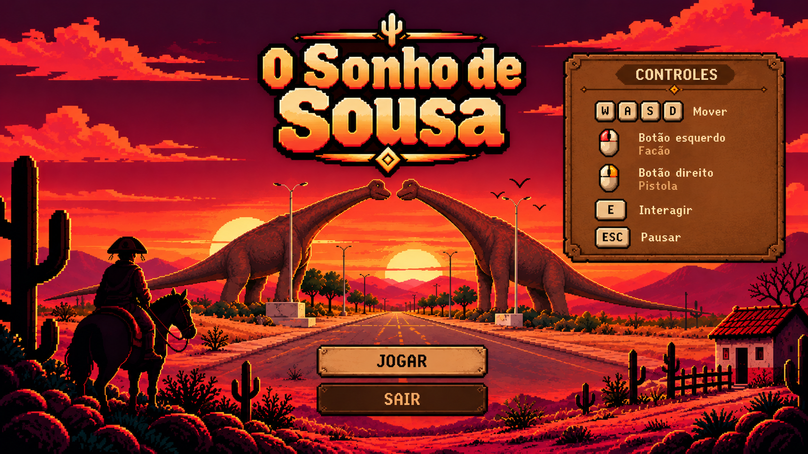

# O Sonho de Sousa

  

Uma aventura de ação e exploração 2D top-down ambientada no sertão paraibano no início do século XX, com referências ao contexto histórico do cangaço.

## Sobre o jogo

Desenvolvido para a GameJam do X SEMITI, no IFPB Campus Monteiro, o jogo acompanha João Grilo em busca de água nos arredores de Sousa. Ele começa em casa e encontra o Padre junto à igreja; o Padre o orienta a procurar três poços. O primeiro é protegido por dois cangaceiros, o segundo por quatro — dois armados com pistolas — e o terceiro por dois dinossauros. Ao encontrar água, João ouve “Foi apenas um sonho...” e retorna para casa, revelando o desfecho da aventura.

## Informações

- Tema: O Sonho de Sousa
- Engine: Godot 4.7.2
- Linguagem: GDScript
- Gênero: ação e exploração 2D top-down
- Ambientação: sertão nordestino, com referência à Paraíba e ao período do cangaço
- Plataforma: desktop
- Exportação planejada: Windows e Linux

## Autores

<table>
  <tr>
    <td align="center">
      <a href="https://github.com/Inocencio-Ferraz">
         
        <strong>Inocencio-Ferraz</strong>
      </a>
    </td>
    <td align="center">
      <a href="https://github.com/Bruno-arj">
         
        <strong>Bruno-arj</strong>
      </a>
    </td>
    <td align="center">
      <a href="https://github.com/Clebio-Luis">
         
        <strong>Clebio-Luis</strong>
      </a>
    </td>
  </tr>
</table>

## Estado do jogo

- Movimentação em oito direções, câmera acompanhando João e colisões no cenário.
- HUD de vida e munição, sistema de vida, facão e pistola com projéteis visíveis.
- Cangaceiros com ataques corpo a corpo e à distância; dinossauros protegem o terceiro poço.
- Cactos interativos podem recuperar vida uma vez cada.
- Padre e diálogos, três poços com acesso condicionado à derrota dos respectivos guardiões e placas de orientação pelo caminho.
- Pausa, tela de Game Over, música, ambiência e efeitos sonoros.
- Efeitos visuais para impactos e derrotas. Após o desfecho do sonho, João retorna para casa.

## Executar

1. Faça o donwload do arquivo zip ao final desse readme.
2. Extrair o arquivo.
3. Executar o arquivo .exe.

## Controles

- W/A/S/D: movimentar
- Mouse esquerdo: atacar com o facão
- Mouse direito: disparar a pistola
- E: interagir com cactos, poços e Padre; avançar diálogos
- Esc: pausar ou continuar

## Créditos

As fontes e licenças dos assets de áudio estão registradas em [CREDITS.md](CREDITS.md).

## Download

[🎮 Baixar O Sonho de Sousa para Windows](https://github.com/Inocencio-Ferraz/Velho-Sertao/releases/latest/download/OSonhoDeSousaVersaoFinal.zip)
